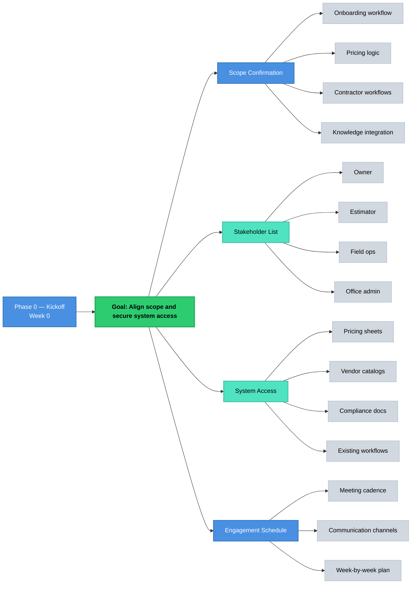
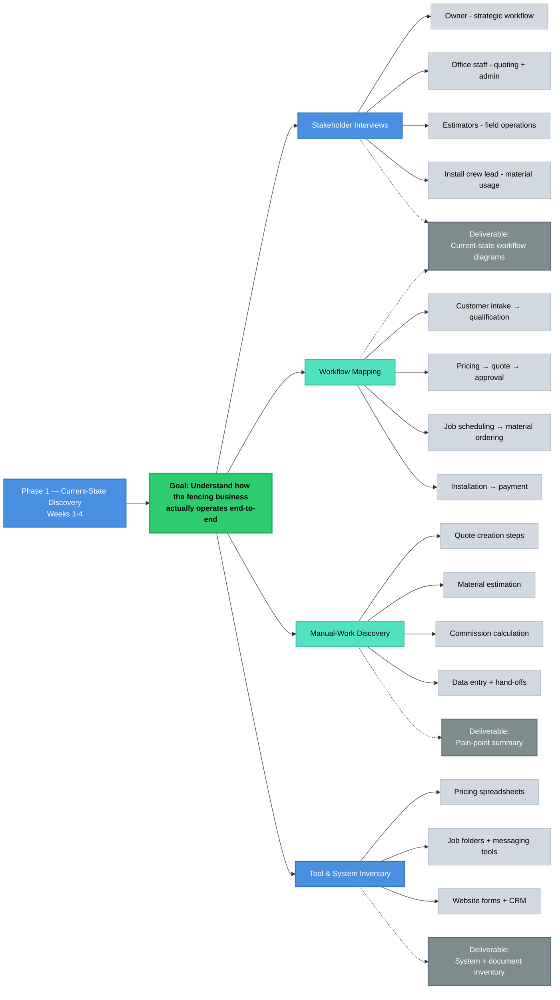
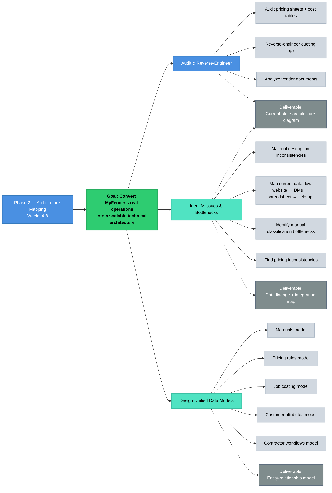
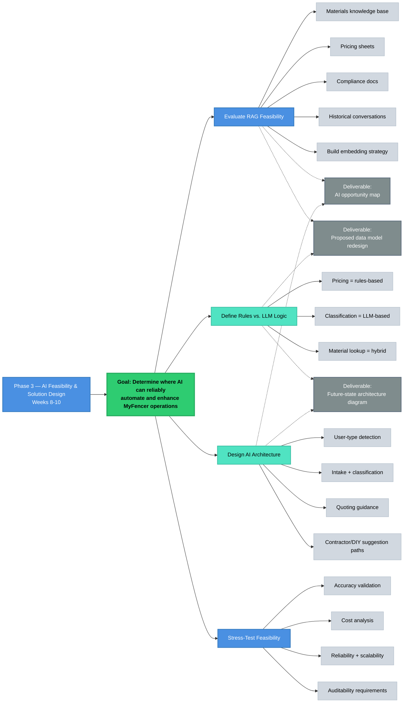
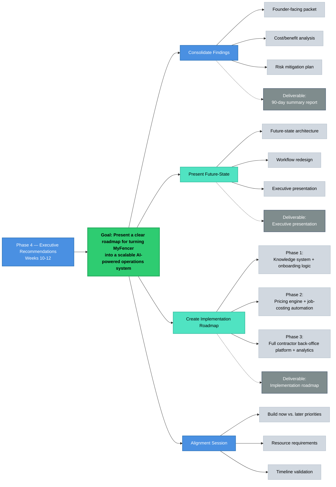

# 90-Day AI Discovery & Architecture Process

## Phase 0 — Kickoff (Week 0)

**Goal:** Align scope and secure system access

**Outputs:**
- Scope confirmation for onboarding, pricing, contractor workflows, and knowledge integration
- Stakeholder list (owner, estimator, field ops, office admin)
- Access to pricing sheets, vendor catalogs, compliance docs, and existing workflows
- Engagement schedule + communication rhythm

---

## Phase 1 — Current-State Discovery (Weeks 1–4)

**Goal:** Understand how the fencing business actually operates end-to-end

### Stakeholder Interviews
- **Owner** — strategic workflow
- **Office staff** — quoting + admin
- **Estimators** — field operations
- **Install crew lead** — job flow + material usage

### Workflow Mapping
Customer intake → qualification → pricing → quote → approval → job scheduling → material ordering → installation → payment

### Analysis
- Pricing worksheets
- Vendor lists
- Historical invoices
- Conversation transcripts

### Manual-Work Discovery
- Quote creation steps
- Material estimation
- Commission calculation
- Data entry + hand-offs

### Tool & System Inventory
- Pricing spreadsheets
- Job folders
- Messaging tools
- Website forms
- CRM (if any)

### Deliverables
- **Current-state workflow diagrams** — intake, pricing, job costing, contractor workflow
- **Pain-point summary**
- **System + document inventory** — pricing sheets, catalogs, compliance PDFs, conversation logs

---

## Phase 2 — Architecture Mapping (Weeks 4–8)

**Goal:** Convert MyFencer's real operations into a scalable technical architecture

### Audit & Reverse-Engineer
- Audit all pricing sheets, cost tables, and vendor documents
- Reverse-engineer existing quoting logic into a clean rules engine structure
- Identify inconsistencies in material descriptions, SKUs, and vendor pricing

### Data Flow Mapping
**Current flow:**
website → DMs → manual quoting → spreadsheet → approval → field ops

### Bottleneck Identification
- Manual classification
- Pricing inconsistencies
- Missing data structure

### Data Model Design
Unified models for:
- Materials
- Pricing rules
- Job costing
- Customer attributes
- Contractor workflows

### Deliverables
- **Current-state architecture diagram**
- **Entity-relationship model** — materials, pricing, job costing, conversations
- **Data lineage & integration map** — how data moves through the business today

---

## Phase 3 — AI Feasibility & Solution Design (Weeks 8–10)

**Goal:** Determine where AI can reliably automate and enhance MyFencer operations

### RAG Feasibility Evaluation
Knowledge base components:
- Materials
- Pricing sheets
- Compliance docs
- Historical conversations

### Rules vs. LLM Logic
- **Pricing** = rules-based
- **Classification** = LLM-based
- **Material lookup** = hybrid approach

### AI Architecture Design
Core capabilities:
- User-type detection
- Intake + classification
- Quoting guidance
- Contractor/DIY suggestion paths

### Embedding Strategy
Build embeddings across pricing tables and material catalogs

### Feasibility Stress-Testing
Validate across:
- Accuracy
- Cost
- Reliability
- Scalability
- Auditability

### Deliverables
- **AI opportunity map** — intake, pricing validation, job costing, material lookup, contractor workflows
- **Future-state architecture diagram**
- **Proposed data model redesign** — materials, pricing, jobs, user types

---

## Phase 4 — Executive Recommendations (Weeks 10–12)

**Goal:** Present a clear roadmap for turning MyFencer into a scalable AI-powered operations system

### Consolidate Findings
Create founder-facing packet with:
- Cost/benefit analysis
- Risk mitigation plan
- Build now vs. later priorities

### Present Future-State
- Architecture redesign
- Workflow optimization
- Executive presentation

### Implementation Roadmap
**3-Phase approach:**
1. **Phase 1** — Knowledge system + onboarding logic
2. **Phase 2** — Pricing engine + job-costing automation
3. **Phase 3** — Full contractor back-office platform + analytics

### Deliverables
- **90-day summary report**
- **Implementation roadmap**
- **Executive-style architecture presentation**

---

## Outcome

**By Day 90, MyFencer achieved:**

- A complete map of all operational workflows
- A unified knowledge schema and data model for pricing, materials, and jobs
- A future-state AI architecture for intake → pricing → job costing
- A clear implementation plan that guided the actual build

This process became the backbone for the MyFencer production system now running in real-world contractor operations.

---

## About MyFencer

**MyFencer** is an AI-driven knowledge and workflow automation system built for fencing contractors.

The platform combines structured business logic, clean data models, and AI-powered reasoning to streamline the entire lifecycle of a fencing project — from initial customer intake to job costing.

### Core Components
- Materials catalog
- Pricing sheets
- Vendor catalogs
- Compliance documents
- Historical conversations
- Approval workflows
- Job costs + margins

### Technology Approach
Centralized knowledge system using:
- Embeddings
- RAG (retrieval-augmented generation)
- Structured rules logic
