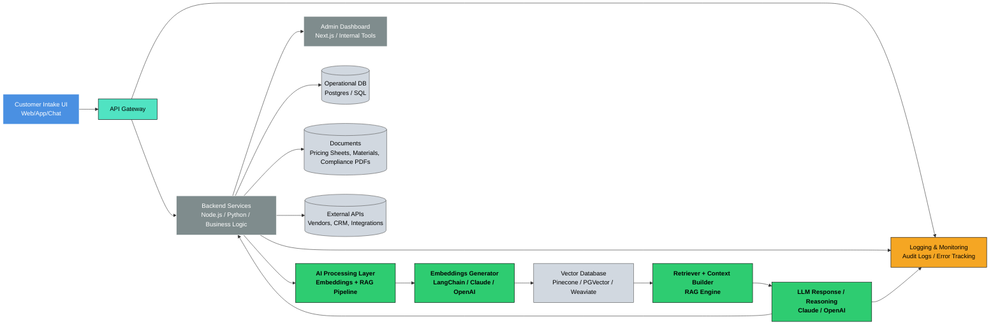

```mermaid
flowchart LR
    %% Classes
    classDef user fill:#4A90E2,stroke:#fff,color:#fff;
    classDef gateway fill:#50E3C2,stroke:#000,color:#000;
    classDef backend fill:#7F8C8D,stroke:#fff,color:#fff;
    classDef data fill:#D1D8E0,stroke:#555,color:#000;
    classDef ai fill:#2ECC71,stroke:#000,color:#000,font-weight:bold;
    classDef monitor fill:#F5A623,stroke:#000,color:#000;

    %% User & Intake
    A[Customer Intake UI<br/>Web/App/Chat]:::user --> B[API Gateway]:::gateway

    %% Gateway sends to backend
    B --> C[Backend Services<br/>Node.js / Python / Business Logic]:::backend

    %% Backend triggers AI layer
    C --> D[AI Processing Layer<br/>Embeddings + RAG Pipeline]:::ai

    %% Embeddings + Vector DB
    D --> E[Embeddings Generator<br/>LangChain / Claude / OpenAI]:::ai
    E --> F[Vector Database<br/>Pinecone / PGVector / Weaviate]:::data

    %% Retrieval
    F --> G[Retriever + Context Builder<br/>RAG Engine]:::ai
    G --> H[LLM Response / Reasoning<br/>Claude / OpenAI]:::ai

    %% Backend receives response
    H --> C

    %% Admin Interfaces
    C --> I[Admin Dashboard<br/>Next.js / Internal Tools]:::backend

    %% Data Sources
    C --> J[(Operational DB<br/>Postgres / SQL)]:::data
    C --> K[(Documents<br/>Pricing Sheets, Materials, Compliance PDFs)]:::data
    C --> L[(External APIs<br/>Vendors, CRM, Integrations)]:::data

    %% Logging & Monitoring
    B --> M[Logging & Monitoring<br/>Audit Logs / Error Tracking]:::monitor
    C --> M
    H --> M
```